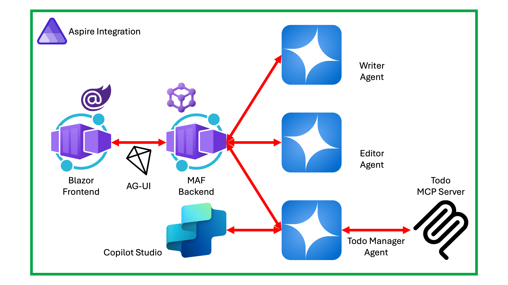

# Microsoft Agent Framework Workshop in a Day (KO)

[Microsoft Agent Framework(MAF)](https://aka.ms/agent-framework)를 활용해서 [Copilot Studio](https://learn.microsoft.com/microsoft-copilot-studio/)와 연동해 보는 워크샵 자료입니다.

## 사전 준비 사항

이 워크샵은 기본적으로 [GitHub Codespaces](https://docs.github.com/codespaces)를 활용해서 진행하기 때문에 아래와 같은 내용만 준비하면 충분합니다.

- 크로미움 계열 웹브라우저 ([Microsoft Edge](https://microsoft.com/edge), [Google Chrome](http://chrome.google.com) 등)
- [Azure 구독](https://azure.microsoft.com/free)
- [GitHub 개인 계정 (무료)](http://github.com/signup) 👉 업무용 계정일 경우 회사 정책에 따라 오작동할 수가 있으니 반드시 개인 계정으로 준비하세요.
- [Microsoft Copilot Studio 평가판 구독](https://go.microsoft.com/fwlink/?LinkId=2107702)

## 전체 아키텍처

이 워크샵을 끝마치면 아래와 같은 시스템이 만들어집니다.

## 시작하기

이 워크샵은 아래와 같은 내용으로 진행합니다. 모두 자기주도학습의 형태로 진행할 수 있으므로, 워크샵 시간에 다 마치지 못하더라도 끝까지 따라해 보세요.

| 세션                                                                  | 링크                                                                                                        |
|-----------------------------------------------------------------------|-------------------------------------------------------------------------------------------------------------|
| 00: 개발 환경 설정                                                    | [00-setup.md](./docs/00-setup.md)                                                                           |
| 01: Microsoft Agent Framework 사용해서 단일 에이전트 개발하기         | [01-single-agent-with-maf.md](./docs/01-single-agent-with-maf.md)                                           |
| 02: Microsoft Agent Framework에 프론트엔드 UI 연동하기                | [02-ui-integration-with-maf.md](./docs/02-ui-integration-with-maf.md)                                       |
| 03: Microsoft Agent Framework 사용해서 다중 에이전트 개발하기         | [03-multi-agent-with-maf.md](./docs/03-multi-agent-with-maf.md)                                             |
| 04: Aspire로 프론트엔드 웹 UI와 백엔드 에이전트 오케스트레이션하기    | [04-aspire-orchestration.md](./docs/04-aspire-orchestration.md)                                             |
| 05: MCP 서버 개발하기                                                 | [05-mcp-server-development.md](./docs/05-mcp-server-development.md)                                         |
| 06: Microsoft Agent Framework에 MCP 서버 연동하기                     | [06-mcp-server-integration-with-maf.md](./docs/06-mcp-server-integration-with-maf.md)                       |
| 07: Copilot Studio에서 에이전트 개발하고 MCP 서버 연동하기 **(선택)** | [07-mcp-server-integration-with-copilot-studio.md](./docs/07-mcp-server-integration-with-copilot-studio.md) |

## 추가 리소스

- [Microsoft Agent Framework (MAF)](https://aka.ms/agent-framework)
- [Copilot Studio](https://learn.microsoft.com/microsoft-copilot-studio/)
- [Model Context Protocol (MCP)](https://modelcontextprotocol.io)
- [MCP .NET 샘플](https://aka.ms/mcp-dotnet-samples)
