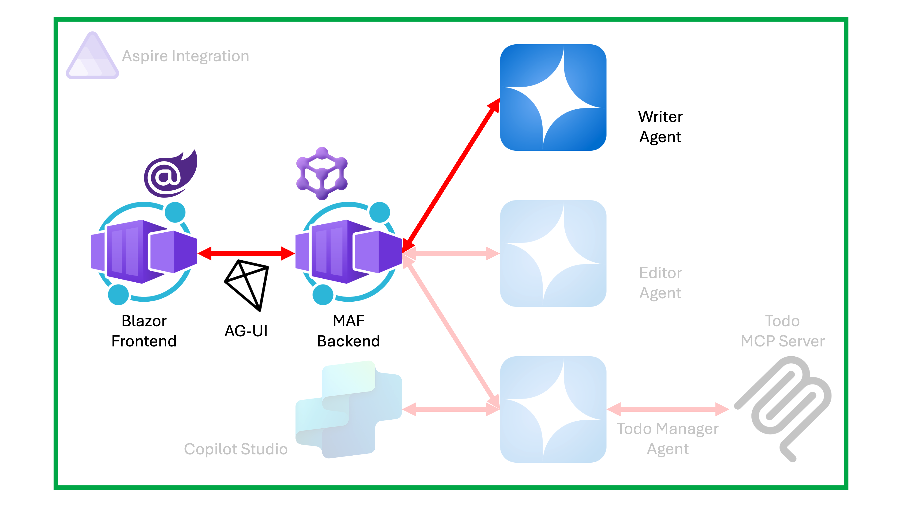

# 02: Microsoft Agent Framework에 프론트엔드 UI 연동하기

이 세션에서는 Microsoft Agent Framework로 만들어진 백엔드 에이전트에 [AG-UI 프로토콜](https://docs.ag-ui.com/introduction)을 활용해서 프론트엔드 웹 UI를 연동합니다.

## 세션 목표

- Microsoft Agent Framework에 AG-UI 프로토콜을 이용해서 프론트엔드 UI를 연결할 수 있습니다.

## 아키텍처

이 세션이 끝나고 나면 아래와 같은 시스템이 만들어집니다.



## 사전 준비 사항

이전 [00: 개발 환경 설정](./00-setup.md)에서 개발 환경을 모두 설정한 상태라고 가정합니다.

## 리포지토리 루트 설정

1. 아래 명령어를 실행시켜 `$REPOSITORY_ROOT` 환경 변수를 설정합니다.

    ```bash
    # zsh/bash
    REPOSITORY_ROOT=$(git rev-parse --show-toplevel)
    ```

    ```powershell
    # PowerShell
    $REPOSITORY_ROOT = git rev-parse --show-toplevel
    ```

## 시작 프로젝트 복사

이 워크샵을 위해 필요한 시작 프로젝트를 준비해 뒀습니다. 시작 프로젝트의 프로젝트 구조는 아래와 같습니다.

```text
save-points/
└── step-02/
    └── start/
        ├── MafWorkshop.sln
        ├── MafWorkshop.Agent/
        │   ├── Properties/
        │   │   └── launchSettings.json
        │   ├── Program.cs
        │   ├── appsettings.json
        │   └── MafWorkshop.Agent.csproj
        └── MafWorkshop.WebUI/
            ├── Properties/
            │   └── launchSettings.json
            ├── Components/
            │   └── < Razor component files >
            ├── wwwroot/
            │   └── < HTML/CSS/JS files >
            ├── Program.cs
            ├── appsettings.json
            └── MafWorkshop.WebUI.csproj
```

> 프로젝트 소개:
>
> - `MafWorkshop.Agent`: 백엔드 에이전트 애플리케이션 프로젝트
> - `MafWorkshop.WebUI`: 프론트엔드 웹 UI 애플리케이션 프로젝트

1. 앞서 실습한 `workshop` 디렉토리가 있다면 삭제하거나 다른 이름으로 바꿔주세요. 예) `workshop-step-01`
1. 터미널을 열고 아래 명령어를 차례로 실행시켜 실습 디렉토리를 만들고 시작 프로젝트를 복사합니다.

    ```bash
    # zsh/bash
    rm -rf $REPOSITORY_ROOT/workshop && \
        mkdir -p $REPOSITORY_ROOT/workshop && \
        cp -a $REPOSITORY_ROOT/save-points/step-02/start/. $REPOSITORY_ROOT/workshop/
    ```

    ```powershell
    # PowerShell
    Remove-Item -Path $REPOSITORY_ROOT/workshop -Recurse -Force && `
        New-Item -Type Directory -Path $REPOSITORY_ROOT/workshop -Force && `
        Copy-Item -Path $REPOSITORY_ROOT/save-points/step-02/start/* -Destination $REPOSITORY_ROOT/workshop -Recurse -Force
    ```

## 시작 프로젝트 빌드 및 실행

1. 워크샵 디렉토리에 있는지 다시 한 번 확인합니다.

    ```bash
    cd $REPOSITORY_ROOT/workshop
    ```

1. 전체 프로젝트를 빌드합니다.

    ```bash
    dotnet restore && dotnet build
    ```

1. 다른 터미널을 열고 프론트엔드 UI 애플리케이션을 실행합니다.

    ```bash
    dotnet watch run --project ./MafWorkshop.WebUI
    ```

1. 자동으로 웹 브라우저가 열리면서 아래와 같은 챗 UI 페이지가 나타나는지 확인합니다.

   

   아무 메시지나 넣고 아래와 같이 가짜 응답이 나오는 것을 확인합니다.

   

1. 터미널에서 `CTRL`+`C` 키를 눌러 애플리케이션 실행을 종료합니다.

## 백엔드 에이전트 앱 AG-UI 프로토콜 연동

1. 워크샵 디렉토리에 있는지 다시 한 번 확인합니다.

    ```bash
    cd $REPOSITORY_ROOT/workshop
    ```

1. `./MafWorkshop.Agent/appsettings.json` 파일을 열고 `LlmProvider` 값이 `GitHubModels`인지 확인합니다. 만약 다른 값으로 되어 있으면 `GitHubModels`로 변경합니다.

    ```jsonc
    {
      "LlmProvider": "GitHubModels"
    }
    ```

   > **Azure 구독이 있는 경우**, `GitHubModels` 대신 `AzureOpenAI`로도 바꿔보세요.

1. `./MafWorkshop.Agent/Program.cs` 파일을 열고 `// AG-UI 등록하기` 주석을 찾아 아래 내용을 추가합니다. 에이전트 앱에 AG-UI 서비스를 사용할 수 있는 서비스 인스턴스를 별도로 로직을 구현하지 않고 직접 의존성 개체로 등록합니다.

    ```csharp
    // AG-UI 등록하기
    builder.Services.AddAGUI();
    ```

1. 같은 파일에서 `// AG-UI 미들웨어 설정하기` 주석을 찾아 아래와 같이 입력합니다. 이 미들웨어를 통해 백엔드 에이전트 앱에 `/ag-ui` 엔드포인트를 추가한 후 이 엔드포인트를 Writer 에이전트로 연결합니다.

    ```csharp
    // AG-UI 미들웨어 설정하기
    app.MapAGUI(
        pattern: "ag-ui",
        aiAgent: app.Services.GetRequiredKeyedService<AIAgent>("writer")
    );
    ```

## 프론트엔드 UI 앱 AG-UI 프로토콜 연동

1. 워크샵 디렉토리에 있는지 다시 한 번 확인합니다.

    ```bash
    cd $REPOSITORY_ROOT/workshop
    ```

1. `./MafWorkshop.WebUI/appsettings.json` 파일을 열고 `AgentEndpoints` 섹션에 아래와 같은 값이 있는지 확인합니다. 만약 아니라면, 아래와 같이 맞춰주세요.

    ```jsonc
    {
      "AgentEndpoints": {
        "Https": "https://localhost:45097",
        "http": "http://localhost:5097"
      }
    }
    ```

1. `./MafWorkshop.WebUI/Program.cs` 파일을 열고 `// HttpClientFactory 등록하기` 주석을 찾아 아래 내용을 추가합니다. `HttpClient` 인스턴스를 `agent`라는 이름으로 등록해서 백엔드 에이전트 애플리케이션을 찾습니다.

    ```csharp
    // HttpClientFactory 등록하기
    builder.Services.AddHttpClient("agent", client =>
    {
        var endpoint = builder.Environment.IsDevelopment() == true
            ? builder.Configuration["AgentEndpoints:Http"]
            : builder.Configuration["AgentEndpoints:Https"];
        client.BaseAddress = new Uri(endpoint!);
    });
    ```

1. 같은 파일에서 `// AG-UI 연동 IChatClient 인스턴스 등록하기` 주석을 찾아 아래와 같은지 확인합니다. 현재 가짜 응답을 생성하는 `FakeChatClient`를 연결한 상태입니다.

    ```csharp
    // AG-UI 연동 IChatClient 인스턴스 등록하기
    builder.Services.AddChatClient(new FakeChatClient());
    ```

   이를 아래와 같이 수정합니다. 백엔드 에이전트 앱의 `/ag-ui` 엔드포인트에 앞서 등록한 `agent` 이름의 `HttpClient` 인스턴스를 연결합니다.

    ```csharp
    // AG-UI 연동 IChatClient 인스턴스 등록하기
    builder.Services.AddChatClient(sp => new AGUIChatClient(
        httpClient: sp.GetRequiredService<IHttpClientFactory>().CreateClient("agent"),
        endpoint: "ag-ui")
    );
    ```

## 애플리케이션 빌드 및 실행

1. 워크샵 디렉토리에 있는지 다시 한 번 확인합니다.

    ```bash
    cd $REPOSITORY_ROOT/workshop
    ```

1. 전체 프로젝트를 빌드합니다.

    ```bash
    dotnet restore && dotnet build
    ```

1. 백엔드 에이전트 애플리케이션을 실행합니다.

    ```bash
    dotnet run --project ./MafWorkshop.Agent
    ```

1. 다른 터미널을 열고 프론트엔드 UI 애플리케이션을 실행합니다.

    ```bash
    dotnet watch run --project ./MafWorkshop.WebUI
    ```

1. 자동으로 웹 브라우저가 열리면서 아래와 같은 챗 UI 페이지가 나타나는지 확인합니다.

   

   아무 문장이나 입력한 후 결과를 확인합니다.

   

1. 두 터미널에서 각각 `CTRL`+`C` 키를 눌러 모든 애플리케이션 실행을 종료합니다.

## 완성본 결과 확인

이 세션의 완성본은 `$REPOSITORY_ROOT/save-points/step-02/complete`에서 확인할 수 있습니다.

1. 앞서 실습한 `workshop` 디렉토리가 있다면 삭제하거나 다른 이름으로 바꿔주세요. 예) `workshop-step-02`
1. 터미널을 열고 아래 명령어를 차례로 실행시켜 실습 디렉토리를 만들고 시작 프로젝트를 복사합니다.

    ```bash
    # zsh/bash
    mkdir -p $REPOSITORY_ROOT/workshop && \
        cp -a $REPOSITORY_ROOT/save-points/step-02/complete/. $REPOSITORY_ROOT/workshop/
    ```

    ```powershell
    # PowerShell
    New-Item -Type Directory -Path $REPOSITORY_ROOT/workshop -Force && `
        Copy-Item -Path $REPOSITORY_ROOT/save-points/step-02/complete/* -Destination $REPOSITORY_ROOT/workshop -Recurse -Force
    ```

1. 워크샵 디렉토리로 이동합니다.

    ```bash
    cd $REPOSITORY_ROOT/workshop
    ```

1. [애플리케이션 빌드 및 실행](#애플리케이션-빌드-및-실행) 섹션을 따라합니다.

---

축하합니다! 에이전트 백엔드에 AG-UI 프로토콜을 활용해서 프론트엔드를 연결했습니다. 이제 다음 단계로 이동하세요!

👈 [01: Microsoft Agent Framework 사용해서 단일 에이전트 개발하기](./01-single-agent-with-maf.md) | [03: Microsoft Agent Framework 사용해서 다중 에이전트 개발하기](./03-multi-agent-with-maf.md) 👉
