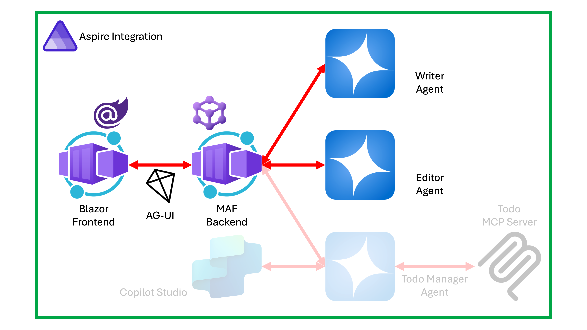

# 04: Aspire로 프론트엔드 웹 UI와 백엔드 에이전트 오케스트레이션하기

이 세션에서는 앞서 개발한 프론트엔드 웹 UI앱과 백엔드 에이전트 앱을 [Aspire](https://aspire.dev)를 이용해 오케스트레이션합니다.

## 세션 목표

- Aspire를 이용해서 프론트엔드 웹 UI와 백엔드 에이전트 및 LLM 커넥션을 오케스트레이션할 수 있습니다.
- Aspire를 통해 Observability(관측용이성) 및 Traceability(추적용이성) 등 클라우드네이티브 관련 기능을 설정할 수 있습니다.
- 전체 애플리케이션을 Azure 클라우드로 배포할 수 있습니다.

## 아키텍처

이 세션이 끝나고 나면 아래와 같은 시스템이 만들어집니다.



## 사전 준비 사항

이전 [00: 개발 환경 설정](./00-setup.md)에서 개발 환경을 모두 설정한 상태라고 가정합니다.

## 리포지토리 루트 설정

1. 아래 명령어를 실행시켜 `$REPOSITORY_ROOT` 환경 변수를 설정합니다.

    ```bash
    # zsh/bash
    REPOSITORY_ROOT=$(git rev-parse --show-toplevel)
    ```

    ```powershell
    # PowerShell
    $REPOSITORY_ROOT = git rev-parse --show-toplevel
    ```

## 시작 프로젝트 복사

이 워크샵을 위해 필요한 시작 프로젝트를 준비해 뒀습니다. 시작 프로젝트의 프로젝트 구조는 아래와 같습니다.

```text
save-points/
└── step-04/
    └── start/
        ├── MafWorkshop.sln
        ├── MafWorkshop.Agent/
        │   ├── Properties/
        │   │   └── launchSettings.json
        │   ├── Program.cs
        │   ├── appsettings.json
        │   └── MafWorkshop.Agent.csproj
        ├── MafWorkshop.WebUI/
        │   ├── Properties/
        │   │   └── launchSettings.json
        │   ├── Components/
        │   │   └── < Razor component files >
        │   ├── wwwroot/
        │   │   └── < HTML/CSS/JS files >
        │   ├── Program.cs
        │   ├── appsettings.json
        │   └── MafWorkshop.WebUI.csproj
        ├── MafWorkshop.AppHost/
        │   ├── Properties/
        │   │   └── launchSettings.json
        │   ├── Program.cs
        │   ├── appsettings.json
        │   └── MafWorkshop.AppHost.csproj
        └── MafWorkshop.ServiceDefaults/
            ├── Extension.cs
            └── MafWorkshop.ServiceDefaults.csproj
```

> 프로젝트 소개:
>
> - `MafWorkshop.Agent`: 백엔드 에이전트 애플리케이션 프로젝트
> - `MafWorkshop.WebUI`: 프론트엔드 웹 UI 애플리케이션 프로젝트
> - `MafWorkshop.AppHost`: Aspire 오케스트레이션 프로젝트
> - `MafWorkshop.ServiceDefaults`: Aspire Observability 및 Traceability 확장 프로젝트

1. 앞서 실습한 `workshop` 디렉토리가 있다면 삭제하거나 다른 이름으로 바꿔주세요. 예) `workshop-step-03`
1. 터미널을 열고 아래 명령어를 차례로 실행시켜 실습 디렉토리를 만들고 시작 프로젝트를 복사합니다.

    ```bash
    # zsh/bash
    rm -rf $REPOSITORY_ROOT/workshop && \
        mkdir -p $REPOSITORY_ROOT/workshop && \
        cp -a $REPOSITORY_ROOT/save-points/step-04/start/. $REPOSITORY_ROOT/workshop/
    ```

    ```powershell
    # PowerShell
    Remove-Item -Path $REPOSITORY_ROOT/workshop -Recurse -Force && `
        New-Item -Type Directory -Path $REPOSITORY_ROOT/workshop -Force && `
        Copy-Item -Path $REPOSITORY_ROOT/save-points/step-04/start/* -Destination $REPOSITORY_ROOT/workshop -Recurse -Force
    ```

## 시작 프로젝트 빌드 및 실행

1. 워크샵 디렉토리에 있는지 다시 한 번 확인합니다.

    ```bash
    cd $REPOSITORY_ROOT/workshop
    ```

1. 전체 프로젝트를 빌드합니다.

    ```bash
    dotnet restore && dotnet build
    ```

1. 백엔드 에이전트 애플리케이션을 실행합니다.

    ```bash
    dotnet run --project ./MafWorkshop.Agent
    ```

1. 다른 터미널을 열고 프론트엔드 UI 애플리케이션을 실행합니다. 새 터미널에서는 `$REPOSITORY_ROOT` 값을 인식하지 못하므로 [리포지토리 루트 설정](#리포지토리-루트-설정) 섹션을 다시 다시 실행시켜야 합니다.

    ```bash
    cd $REPOSITORY_ROOT/workshop
    dotnet watch run --project ./MafWorkshop.WebUI
    ```

1. 자동으로 웹 브라우저가 열리면서 아래와 같은 챗 UI 페이지가 나타나는지 확인합니다.

   

   아무 문장이나 입력한 후 결과를 확인합니다.

   

1. 두 터미널에서 각각 `CTRL`+`C` 키를 눌러 모든 애플리케이션 실행을 종료합니다.

## Observability 및 Traceability 도구 연동 - 백엔드 에이전트

1. 워크샵 디렉토리에 있는지 다시 한 번 확인합니다.

    ```bash
    cd $REPOSITORY_ROOT/workshop
    ```

1. 아래 명령어를 실행시켜 Observability 및 Traceability 도구를 추가합니다.

    ```bash
    dotnet add ./MafWorkshop.Agent reference ./MafWorkshop.ServiceDefaults
    ```

1. `./MafWorkshop.Agent/Program.cs` 파일을 열고 `// Observability 및 Traceability를 위한 Service Defaults 추가하기` 주석을 찾아 아래 내용을 추가합니다. 이를 통해 다양한 Observability 및 Traceability 기능 관련 인스턴스를 의존성 개체로 등록합니다.

    ```csharp
    // Observability 및 Traceability를 위한 Service Defaults 추가하기
    builder.AddServiceDefaults();
    ```

1. 같은 파일에서 `// Observability 및 Traceability를 위한 미들웨어 설정하기` 주석을 찾아 아래와 같이 입력합니다. 서비스의 가용성 확인을 위한 헬스체크 엔드포인트를 추가하는 미들웨어입니다.

    ```csharp
    // Observability 및 Traceability를 위한 미들웨어 설정하기
    app.MapDefaultEndpoints();
    ```

## Observability 및 Traceability 도구 연동 - 프론트엔드 웹 UI

1. 워크샵 디렉토리에 있는지 다시 한 번 확인합니다.

    ```bash
    cd $REPOSITORY_ROOT/workshop
    ```

1. 아래 명령어를 실행시켜 Observability 및 Traceability 도구를 추가합니다.

    ```bash
    dotnet add ./MafWorkshop.WebUI reference ./MafWorkshop.ServiceDefaults
    ```

1. `./MafWorkshop.WebUI/Program.cs` 파일을 열고 `// Observability 및 Traceability를 위한 Service Defaults 추가하기` 주석을 찾아 아래 내용을 추가합니다. 백엔드 에이전트 앱과 마찬가지로 이를 통해 다양한 Observability 및 Traceability 기능 관련 인스턴스를 의존성 개체로 등록합니다.

    ```csharp
    // Observability 및 Traceability를 위한 Service Defaults 추가하기
    builder.AddServiceDefaults();
    ```

1. 같은 파일에서 `// Observability 및 Traceability를 위한 미들웨어 설정하기` 주석을 찾아 아래와 같이 입력합니다. 백엔드 에이전트 앱과 마찬가지로 서비스의 가용성 확인을 위한 헬스체크 엔드포인트를 추가하는 미들웨어입니다.

    ```csharp
    // Observability 및 Traceability를 위한 미들웨어 설정하기
    app.MapDefaultEndpoints();
    ```

## Aspire 오케스트레이션 구성 - 호스트

1. 워크샵 디렉토리에 있는지 다시 한 번 확인합니다.

    ```bash
    cd $REPOSITORY_ROOT/workshop
    ```

1. 아래 명령어를 실행시켜 오케스트레이션을 위한 백엔드 및 프론트엔드 애플리케이션을 추가합니다.

    ```bash
    dotnet add ./MafWorkshop.AppHost reference ./MafWorkshop.Agent
    dotnet add ./MafWorkshop.AppHost reference ./MafWorkshop.WebUI
    ```

1. 아래 명령어를 실행시켜 Aspire 오케스트레이션을 위한 호스트 패키지를 설치합니다.

    ```bash
    dotnet add ./MafWorkshop.AppHost package Aspire.Hosting.GitHub.Models
    dotnet add ./MafWorkshop.AppHost package Aspire.Hosting.OpenAI
    ```

1. `./MafWorkshop.AppHost/AppHost.cs` 파일을 열고 `// LlmResourceFactory 클래스 추가하기` 주석을 찾아 아래 내용을 추가합니다. 백엔드 에이전트 앱에서 구현했던 `ChatClientFactory` 클래스와 비슷한 형태라고 볼 수 있습니다. 다만, `ChatClientFactory` 클래스에서는 `IChatClient` 인스턴스를 직접 생성하지만, `LlmResourceFactory` 클래스는 리소스 레퍼런스를 생성한다는 차이가 있습니다.

    ```csharp
    // LlmResourceFactory 클래스 추가하기
    public static class LlmResourceFactory
    {
        public static IResourceBuilder<ProjectResource> WithLlmReference(this IResourceBuilder<ProjectResource> source, IConfiguration config)
        {
            var provider = config["LlmProvider"] ?? throw new InvalidOperationException("Missing configuration: LlmProvider");
            source = provider switch
            {
                "GitHubModels" => AddGitHubModelsResource(source, config),
                "AzureOpenAI" => AddAzureOpenAIResource(source, config),
                _ => throw new NotSupportedException($"The specified LLM provider '{provider}' is not supported.")
            };
    
            return source;
        }
    
        private static IResourceBuilder<ProjectResource> AddGitHubModelsResource(IResourceBuilder<ProjectResource> source, IConfiguration config)
        {
            var provider = config["LlmProvider"];
    
            var github = config.GetSection("GitHub");
            var endpoint = github["Endpoint"] ?? throw new InvalidOperationException("Missing configuration: GitHub:Endpoint");
            var token = github["Token"] ?? throw new InvalidOperationException("Missing configuration: GitHub:Token");
            var model = github["Model"] ?? throw new InvalidOperationException("Missing configuration: GitHub:Model");
    
            Console.WriteLine();
            Console.WriteLine($"\tUsing {provider}: {model}");
            Console.WriteLine();
    
            var apiKey = source.ApplicationBuilder
                               .AddParameter(name: "apiKey", value: token, secret: true);
            var chat = source.ApplicationBuilder
                             .AddGitHubModel(name: "chat", model: model)
                             .WithApiKey(apiKey);
    
            return source.WithReference(chat)
                         .WaitFor(chat);
        }
    
        private static IResourceBuilder<ProjectResource> AddAzureOpenAIResource(IResourceBuilder<ProjectResource> source, IConfiguration config)
        {
            var provider = config["LlmProvider"];
    
            var azure = config.GetSection("Azure:OpenAI");
            var endpoint = azure["Endpoint"] ?? throw new InvalidOperationException("Missing configuration: Azure:OpenAI:Endpoint");
            var accessKey = azure["ApiKey"] ?? throw new InvalidOperationException("Missing configuration: Azure:OpenAI:ApiKey");
            var deploymentName = azure["DeploymentName"] ?? throw new InvalidOperationException("Missing configuration: Azure:OpenAI:DeploymentName");
    
            Console.WriteLine();
            Console.WriteLine($"\tUsing {provider}: {deploymentName}");
            Console.WriteLine();
    
            var apiKey = source.ApplicationBuilder
                               .AddParameter(name: "apiKey", value: accessKey, secret: true);
            var chat = source.ApplicationBuilder
                             .AddOpenAI("openai")
                             .WithEndpoint($"{endpoint.TrimEnd('/')}/openai/v1/")
                             .WithApiKey(apiKey)
                             .AddModel(name: "chat", model: deploymentName);
    
            return source.WithReference(chat)
                         .WaitFor(chat);
        }
    }
    ```

1. 같은 파일에서 `// 백엔드 에이전트 프로젝트 추가하기` 주석을 찾아 아래와 같이 입력합니다. 백엔드 에이전트 앱을 `agent`라는 리소스로 선언하고 여기에 앞서 작성한 `WithLlmReference` 메소드를 통해 LLM 리소스를 연결합니다.

    ```csharp
    // 백엔드 에이전트 프로젝트 추가하기
    var agent = builder.AddProject<Projects.MafWorkshop_Agent>("agent")
                       .WithExternalHttpEndpoints()
                       .WithLlmReference(builder.Configuration);
    ```

1. 같은 파일에서 `// 프론트엔드 웹 UI 프로젝트 추가하기` 주석을 찾아 아래와 같이 입력합니다. 프론트엔드 웹 UI 앱을 `webUI`라는 리소스로 선언하고 거기에 방금 작성한 `agent` 리소스를 연결합니다.

    ```csharp
    // 프론트엔드 웹 UI 프로젝트 추가하기
    var webUI = builder.AddProject<Projects.MafWorkshop_WebUI>("webui")
                        .WithExternalHttpEndpoints()
                        .WithReference(agent)
                        .WaitFor(agent);
    ```

## Aspire 오케스트레이션 구성 - 백엔드 에이전트

1. 워크샵 디렉토리에 있는지 다시 한 번 확인합니다.

    ```bash
    cd $REPOSITORY_ROOT/workshop
    ```

1. 아래 명령어를 실행시켜 Aspire 오케스트레이션을 위한 클라이언트 패키지를 백엔드 에이전트 애플리케이션에 설치합니다.

    ```bash
    dotnet add ./MafWorkshop.Agent package Aspire.OpenAI --prerelease
    ```

1. `./MafWorkshop.Agent/appsettings.json` 파일을 열고 `LlmProvider`, `Azure`, `GitHub` 항목을 모두 삭제합니다. Aspire의 `AppHost` 프로젝트에서 대신 해결해 주기 때문에 더이상 이 로직이 필요없습니다.
1. `./MafWorkshop.Agent/Program.cs` 파일을 열고 `// IChatClient 인스턴스 생성하기` 주석을 찾아 바로 아래에 있는 코드를 삭제합니다. 마찬가지로 Aspire의 `AppHost` 프로젝트에서 대신 해결해 주기 때문에 더이상 이 로직이 필요없습니다.

   **삭제전:**

    ```csharp
    // IChatClient 인스턴스 생성하기
    IChatClient? chatClient = ChatClientFactory.CreateChatClient(builder.Configuration);
    ```

    **삭제후:** 주석만 남아있습니다.

    ```csharp
    // IChatClient 인스턴스 생성하기
    ```

1. 같은 파일에서 `// IChatClient 인스턴스 등록하기` 주석을 찾아 아래와 같이 변경합니다. Aspire에서 넘어오는 `IChatClient` 인스턴스를 직접 의존성 개체로 등록합니다.

   **변경전:**

    ```csharp
    // IChatClient 인스턴스 등록하기
    builder.Services.AddChatClient(chatClient);
    ```

   **변경후:**

    ```csharp
    // IChatClient 인스턴스 등록하기
    builder.AddOpenAIClient("chat")
           .AddChatClient();
    ```

## Aspire 오케스트레이션 구성 - 프론트엔드 웹 UI

1. 워크샵 디렉토리에 있는지 다시 한 번 확인합니다.

    ```bash
    cd $REPOSITORY_ROOT/workshop
    ```

1. `./MafWorkshop.WebUI/appsettings.json` 파일을 열고 `AgentEndpoints` 항목을 삭제합니다. Aspire의 `AppHost` 프로젝트에서 대신 해결해 주기 때문에 더이상 이 로직이 필요없습니다.
1. `./MafWorkshop.WebUI/Program.cs` 파일을 열고 `// HttpClientFactory 등록하기` 주석을 찾아 아래와 같이 변경합니다. 마찬가지로 Aspire의 `AppHost` 프로젝트에서 대신 해결해 주기 때문에 Aspire에서 전달 받은 `IHttpClientFactory` 인스턴스를 의존성 개체로 등록합니다.

   **변경전:**

    ```csharp
    // HttpClientFactory 등록하기
    builder.Services.AddHttpClient("agent", client =>
    {
        var endpoint = builder.Environment.IsDevelopment() == true
            ? builder.Configuration["AgentEndpoints:Http"]
            : builder.Configuration["AgentEndpoints:Https"];
        client.BaseAddress = new Uri(endpoint!);
    });
    ```

   **변경후:**

    ```csharp
    // HttpClientFactory 등록하기
    builder.Services.AddHttpClient("agent", client =>
    {
        client.BaseAddress = new Uri("https+http://agent");
    });
    ```

## 애플리케이션 빌드 및 실행

1. 워크샵 디렉토리에 있는지 다시 한 번 확인합니다.

    ```bash
    cd $REPOSITORY_ROOT/workshop
    ```

1. 전체 프로젝트를 빌드합니다.

    ```bash
    dotnet restore && dotnet build
    ```

1. Aspire 오케스트레이션 애플리케이션을 실행합니다.

    ```bash
    dotnet watch run --project ./MafWorkshop.AppHost
    ```

1. 자동으로 웹 브라우저가 열리면서 아래와 같은 Aspire 대시보드 페이지가 나타나는지 확인합니다.

   

   > **NOTE**: 만약 대시보드 페이지가 보이지 않고 에러가 난다면 터미널에서 아래와 비슷한 URL을 클릭해서 대시보드를 열어보세요.
   >
   > ```text
   > https://awesome-workshop-45397.app.github.dev/login?t=12345678abcdefgh90123456ijklmnop
   > ```

1. 터미널에서 `CTRL`+`C` 키를 눌러 애플리케이션 실행을 종료합니다.
1. `./MafWorkshop.AppHost/appsettings.json` 파일을 열고 `LlmProvider` 값을 `AzureOpenAI`로 변경합니다.

    ```jsonc
    {
      "LlmProvider": "AzureOpenAI"
    }
    ```

1. 다시 Aspire 오케스트레이션 앱을 실행시켜 아래와 같은 Aspire 대시보드 페이지가 나타나는지 확인합니다.

   

1. 백엔드 에이전트 앱 링크를 클릭해서 Dev UI 화면이 잘 보이는지 확인합니다. 그리고, Publish 워크플로우를 선택해서 잘 동작하는지 확인합니다.
1. 프론트엔드 웹 UI 앱 링크를 클릭해서 챗 UI 화면이 잘 보이는지 확인합니다. 그리고, 메시지를 입력해서 결과를 잘 출력하는지 확인합니다.
1. Aspire 대시보드에서 Traces 탭으로 이동합니다. 그리고 `agent` 리소스를 선택한 후 전체 데이터 흐름을 살펴봅니다.

   

   프론트엔드 웹 UI 화면부터 백엔드 에이전트를 거쳐 LLM 서비스까지 데이터가 오고간 과정을 확인합니다.

   

1. 터미널에서 `CTRL`+`C` 키를 눌러 애플리케이션 실행을 종료합니다.

## 애플리케이션 배포 및 실행

> **NOTE**: Azure 구독을 제공 받았을 경우 진행하세요. 워크샵에 따라 Azure 구독을 제공하지 않을 수도 있습니다.

1. 워크샵 디렉토리에 있는지 다시 한 번 확인합니다.

    ```bash
    cd $REPOSITORY_ROOT/workshop
    ```

1. `./MafWorkshop.AppHost/appsettings.json` 파일을 열고 `LlmProvider` 값이 `GitHubModels`인지 `AzureOpenAI`인지 확인합니다.
1. 아래 명령어를 실행시켜 전체 애플리케이션을 배포하세요.

    ```bash
    azd up
    ```

   아래와 같은 질문이 나오면 적당하게 입력합니다.

   - `? Enter a unique environment name:` 👉 환경 이름 (예: `mafworkshop-2026`)
   - `? Enter a value for the 'apiKey' infrastructure secured parameter:` 👉 API 키 값 입력 - `LlmProvider` 값이 `GitHubModels`이면 GitHub PAT 값을, `AzureOpenAI`이면 Azure OpenAI 인스턴스의 API 키 값을 입력합니다.

   잠시 기다리면 프론트엔드 웹 UI 및 백엔드 에이전트를 배포한 Azure Container Apps 인스턴스가 각각 만들어진 것을 확인할 수 있습니다.

   

1. 위 스크린샷의 `webui` 링크를 클릭해서 웹 UI 화면이 나오면 메시지를 입력해서 결과를 잘 출력하는지 확인합니다.

   

1. 아래 명령어를 실행시켜 방금 배포한 애플리케이션을 모두 삭제합니다.

    ```bash
    azd down --purge --force
    ```

## 완성본 결과 확인

이 세션의 완성본은 `$REPOSITORY_ROOT/save-points/step-04/complete`에서 확인할 수 있습니다.

1. 앞서 실습한 `workshop` 디렉토리가 있다면 삭제하거나 다른 이름으로 바꿔주세요. 예) `workshop-step-04`
1. 터미널을 열고 아래 명령어를 차례로 실행시켜 실습 디렉토리를 만들고 시작 프로젝트를 복사합니다.

    ```bash
    # zsh/bash
    mkdir -p $REPOSITORY_ROOT/workshop && \
        cp -a $REPOSITORY_ROOT/save-points/step-04/complete/. $REPOSITORY_ROOT/workshop/
    ```

    ```powershell
    # PowerShell
    New-Item -Type Directory -Path $REPOSITORY_ROOT/workshop -Force && `
        Copy-Item -Path $REPOSITORY_ROOT/save-points/step-04/complete/* -Destination $REPOSITORY_ROOT/workshop -Recurse -Force
    ```

1. 워크샵 디렉토리로 이동합니다.

    ```bash
    cd $REPOSITORY_ROOT/workshop
    ```

1. [애플리케이션 빌드 및 실행](#애플리케이션-빌드-및-실행) 섹션을 따라합니다.
1. [애플리케이션 배포 및 실행](#애플리케이션-배포-및-실행) 섹션을 따라합니다.

---

축하합니다! Aspire로 프론트엔드 웹 UI와 백엔드 에이전트 앱 그리고 다양한 LLM을 모두 오케스트레이션했습니다. 이제 다음 단계로 이동하세요!

👈 [03: Microsoft Agent Framework 사용해서 다중 에이전트 개발하기](./03-multi-agent-with-maf.md) | [05: MCP 서버 개발하기](./05-mcp-server-development.md) 👉
