# 07: Copilot Studio에서 에이전트 개발하고 MCP 서버 연동하기 (선택)

이 세션에서는 앞서 만들었던 [MCP 서버](./05-mcp-server-development.md)를 [Copilot Studio](https://learn.microsoft.com/microsoft-copilot-studio/fundamentals-what-is-copilot-studio)의 에이전트에 연동합니다.

## 세션 목표

- 로컬 MCP 서버를 Copilot Studio에 연동시킬 수 있습니다.
- 리모트 MCP 서버를 Copilot Studio에 연동시킬 수 있습니다.

## 사전 준비 사항

이전 [00: 개발 환경 설정](./00-setup.md)에서 개발 환경을 모두 설정한 상태라고 가정합니다.

## 리포지토리 루트 설정

1. 아래 명령어를 실행시켜 `$REPOSITORY_ROOT` 환경 변수를 설정합니다.

    ```bash
    # zsh/bash
    REPOSITORY_ROOT=$(git rev-parse --show-toplevel)
    ```

    ```powershell
    # PowerShell
    $REPOSITORY_ROOT = git rev-parse --show-toplevel
    ```

## 시작 프로젝트 복사

이 워크샵을 위해 필요한 시작 프로젝트를 준비해 뒀습니다. 시작 프로젝트의 프로젝트 구조는 아래와 같습니다.

```text
save-points/
└── step-07/
    └── start/
        ├── infra/
        │   └── < bicep files >
        ├── MafWorkshop.sln
        └── MafWorkshop.McpTodo/
            ├── Properties/
            │   └── launchSettings.json
            ├── TodoDbContext.cs
            ├── Program.cs
            ├── appsettings.json
            └── MafWorkshop.McpTodo.csproj
```

> 프로젝트 소개:
>
> - `infra`: Azure 클라우드 리소스 배포용 bicep 파일 디렉토리
> - `MafWorkshop.McpTodo`: To-do 리스트 관리용 MCP 서버 프로젝트

1. 앞서 실습한 `workshop` 디렉토리가 있다면 삭제하거나 다른 이름으로 바꿔주세요. 예) `workshop-step-06`
1. 터미널을 열고 아래 명령어를 차례로 실행시켜 실습 디렉토리를 만들고 시작 프로젝트를 복사합니다.

    ```bash
    # zsh/bash
    rm -rf $REPOSITORY_ROOT/workshop && \
        mkdir -p $REPOSITORY_ROOT/workshop && \
        cp -a $REPOSITORY_ROOT/save-points/step-07/start/. $REPOSITORY_ROOT/workshop/
    ```

    ```powershell
    # PowerShell
    Remove-Item -Path $REPOSITORY_ROOT/workshop -Recurse -Force && `
        New-Item -Type Directory -Path $REPOSITORY_ROOT/workshop -Force && `
        Copy-Item -Path $REPOSITORY_ROOT/save-points/step-07/start/* -Destination $REPOSITORY_ROOT/workshop -Recurse -Force
    ```

## 시작 프로젝트 빌드 및 실행

1. 워크샵 디렉토리에 있는지 다시 한 번 확인합니다.

    ```bash
    cd $REPOSITORY_ROOT/workshop
    ```

1. 전체 프로젝트를 빌드합니다.

    ```bash
    dotnet restore && dotnet build
    ```

## Copilot Studio 접속 및 에이전트 생성

> 워크샵 진행자로부터 받은 Copilot Studio 접속 정보를 이용합니다.
>
> **중요**: Copilot Studio의 UI는 시간에 따라 변화하므로 스크린샷과 다를 수도 있습니다.

1. [Copilot Studio](https://copilotstudio.microsoft.com)에 로그인합니다.

   

1. Agent 탭으로 이동해 [➕ Create blank agent] 버튼을 클릭합니다.

   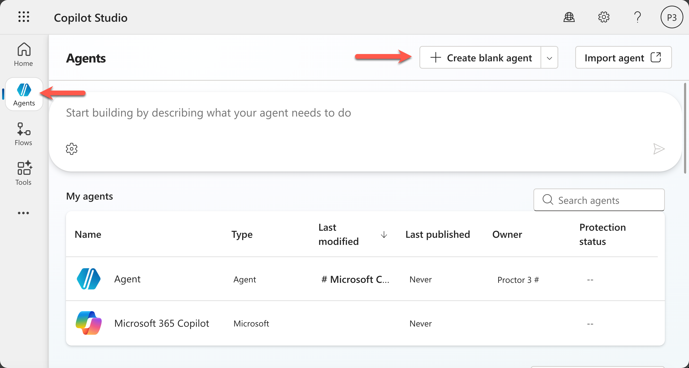

   에이전트가 하나 만들어졌습니다.

   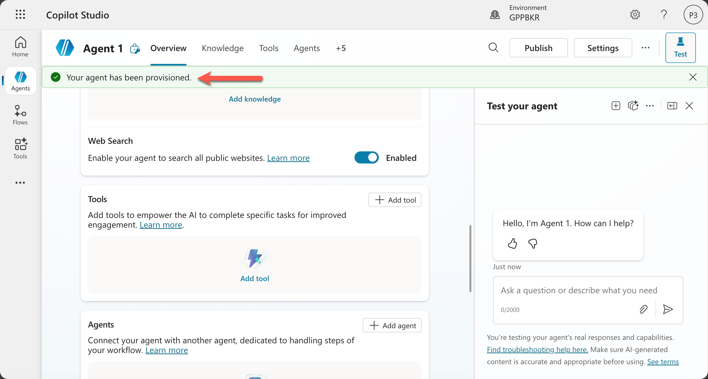

## 로컬 MCP 서버 실행

1. 워크샵 디렉토리에 있는지 다시 한 번 확인합니다.

    ```bash
    cd $REPOSITORY_ROOT/workshop
    ```

1. MCP 서버 애플리케이션을 실행합니다.

    ```bash
    dotnet run --project ./MafWorkshop.McpTodo
    ```

   

1. MCP 서버는 현재 로컬에서만 작동하므로 외부에서 접속할 수 없습니다. 아래 그림과 같이 외부에서 접근할 수 있도록 포트를 열어줍니다. 현재 MCP 서버는 `5497` 포트를 사용합니다.

   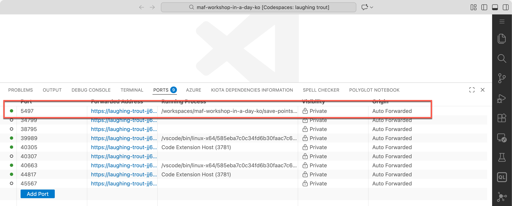

   포트를 누구나 접속할 수 있도록 `Public`으로 조정합니다.

   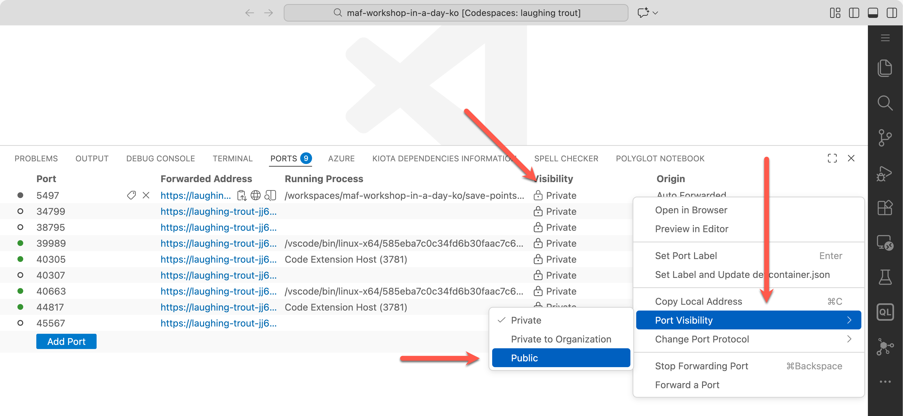

   MCP 서버 포트가 인터넷으로 누구나 접속할 수 있도록 바뀌었습니다.

   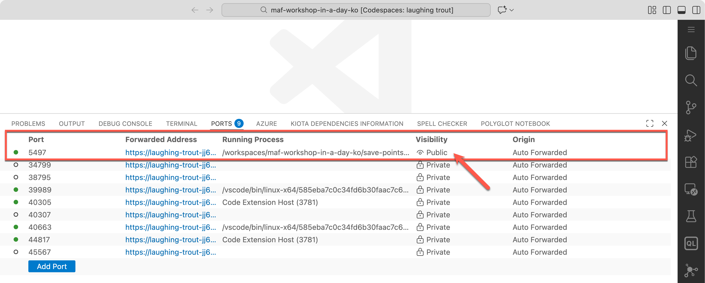

   [Forwarded Address] 컬럼의 접속 URL값을 복사해 둡니다. URL 형식은 대략 `https://{인스턴스이름}-{랜덤문자}-{포트번호}.app.github.dev/`와 비슷합니다. 예를 들어 여기서는 `https://laughing-trout-jj69pprrgwcj6px-5497.app.github.dev/` 라고 하겠습니다.

## Copilot Studio 에이전트에 로컬 MCP 서버 연결 및 실행

1. 앞서 만든 에이전트의 상단 [Tools] 탭으로 이동한 후 [➕ Add a tool] 버튼을 클릭합니다.

   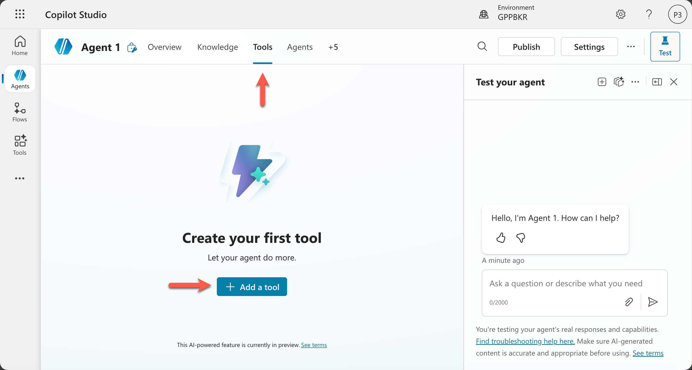

   이어 [➕ New tool] 버튼을 클릭합니다.

   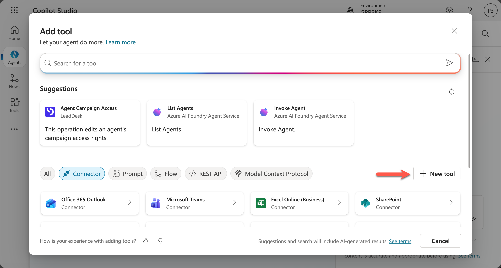

1. [Model Context Protocol] 버튼을 클릭합니다.

   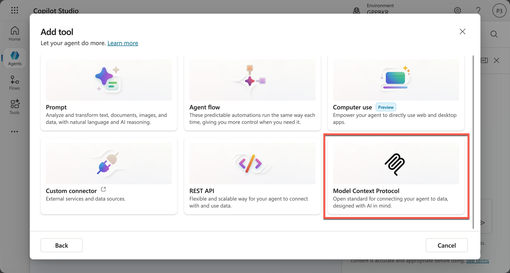

1. 아래 그림과 같이 MCP 서버 접속 정보를 입력합니다. 이후 [Create] 버튼을 클릭합니다.

   

   - `Server name`: `Todo Manager Local XXX` 👈 입력. XXX는 랜덤 숫자 또는 문자
   - `Server description`: `To-do 리스트 아이템의 생성/수정/삭제 등을 담당하는 MCP 서버입니다.` 👈 입력
   - `Server URL`: 앞서 복사해 둔 로컬 MCP 서버용 공개 주소 + `/mcp` 입력 (예: `https://laughing-trout-jj69pprrgwcj6px-5497.app.github.dev/mcp`)
   - `Authentication`: `None` 👈 선택

1. 아래 화면이 나타나면 [Not connected] 버튼을 클릭한 후 [Create new connection] 버튼을 클릭합니다.

   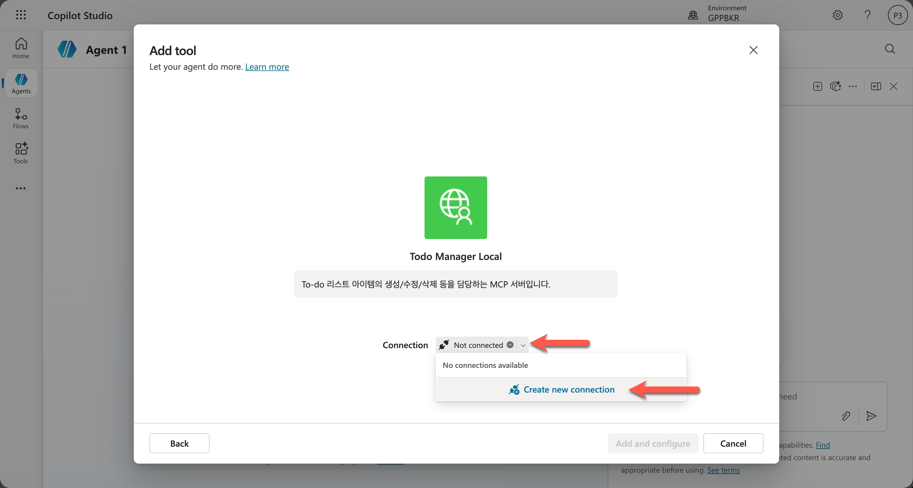

   이후 [Create] 버튼을 눌러 로컬 MCP 서버와 연결합니다.

   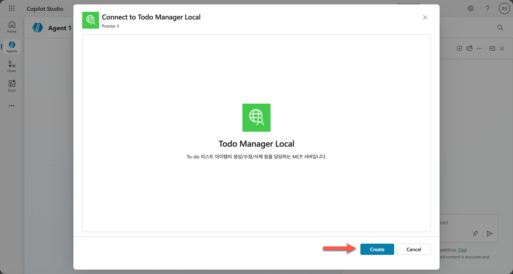

   이후 [Add and configure] 버튼을 클릭해서 로컬 MCP 서버를 에이전트에 추가합니다.

1. Copilot Studio에서 [Tools] 탭으로 이동한 후 [➕ New tool] 버튼을 클릭합니다.

   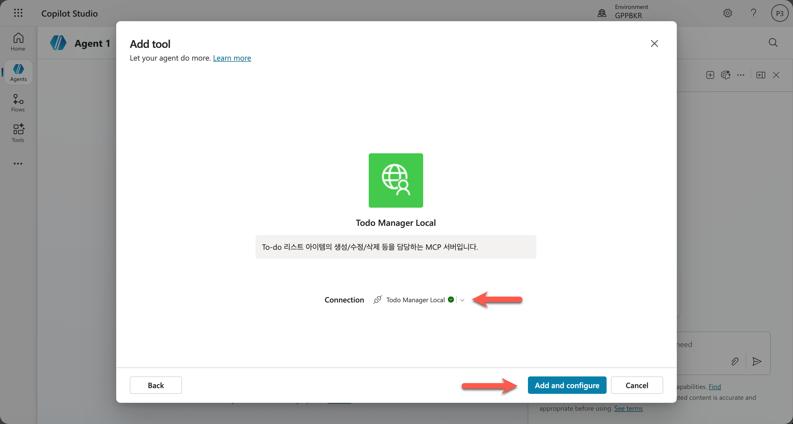

   MCP 서버에 정의해 둔 Tool이 보입니다.

   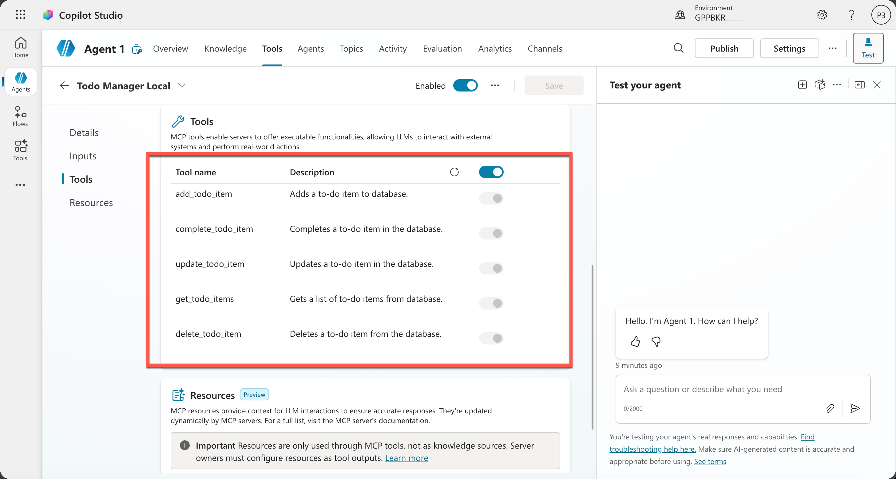

1. [Settings] 버튼을 클릭합니다.

   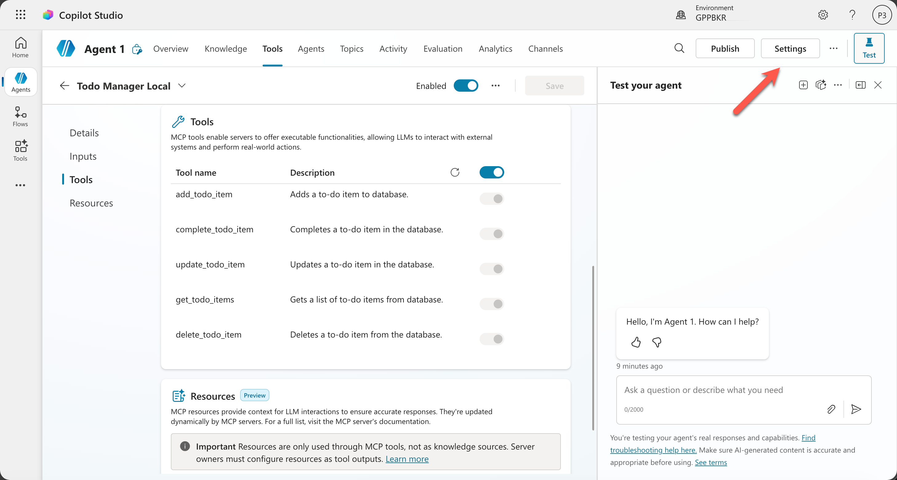

   현재 에이전트에 연결한 MCP 서버가 보입니다. [Connect] 링크를 클릭합니다.

   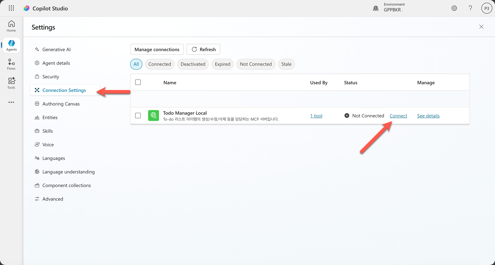

   [Submit] 버튼을 클릭합니다.

   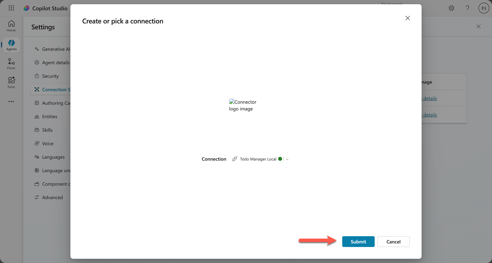

   커넥션 연결을 완료했습니다. 오른쪽 위의 [X] 버튼을 클릭해서 에이전트 Settings 화면을 빠져나갑니다.

   

1. 아래와 같이 오른쪽 테스트 세션에서 다양하게 프롬프트를 실행시켜 보고 그 결과를 확인합니다.

   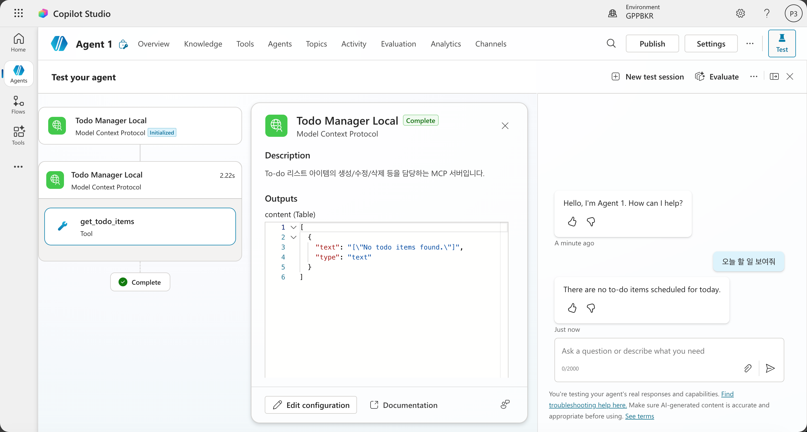

   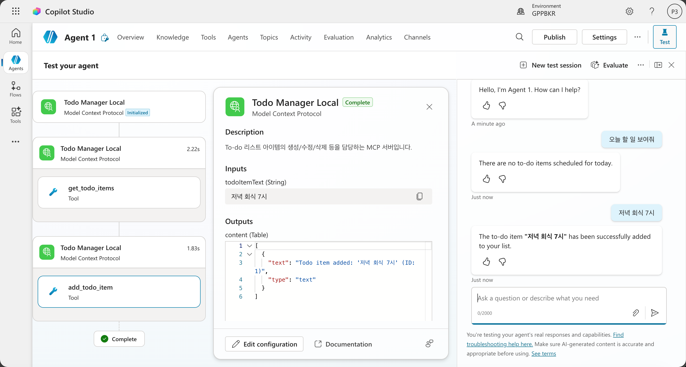

   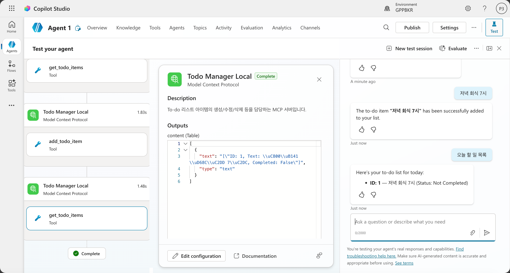

## 로컬 MCP 서버 종료

1. 터미널에서 `CTRL`+`C` 키를 눌러 애플리케이션 실행을 종료합니다.

## 리모트 MCP 서버 배포

> **NOTE**: Azure 구독을 제공 받았을 경우 진행하세요. 워크샵에 따라 Azure 구독을 제공하지 않을 수도 있습니다.

1. 워크샵 디렉토리에 있는지 다시 한 번 확인합니다.

    ```bash
    cd $REPOSITORY_ROOT/workshop
    ```

1. 아래 명령어를 실행시켜 MCP 서버를 배포하세요.

    ```bash
    azd up
    ```

   아래와 같은 질문이 나오면 적당하게 입력합니다.

   - `? Enter a unique environment name:` 👉 환경 이름 (예: `mafworkshop-2026`)
   - `? Enter a value for the 'location' infrastructure parameter:` 👉 지역 선택 (예: `Korea Central`)

   잠시 기다리면 MCP 서버를 배포한 Azure Container Apps 인스턴스가 만들어진 것을 확인할 수 있습니다.

1. 아래 명령어를 실행시켜 Azure Container Apps 인스턴스의 URL 값을 확인합니다. URL의 형식은 `mafworkshop-mcptodo.{랜덤문자열}-{랜덤숫자}.{지역}.azurecontainerapps.io`입니다.

    ```bash
    azd env get-value AZURE_RESOURCE_MAFWORKSHOP_MCPTODO_FQDN
    ```

## Copilot Studio에 리모트 MCP 서버 연결 및 실행

> **NOTE**: Azure 구독을 제공 받았을 경우 진행하세요. 워크샵에 따라 Azure 구독을 제공하지 않을 수도 있습니다.

1. 앞서 만든 에이전트의 상단 [Tools] 탭으로 이동한 후 [➕ Add a tool] 버튼을 클릭합니다.

   

   이어 [➕ New tool] 버튼을 클릭합니다.

   

1. [Model Context Protocol] 버튼을 클릭합니다.

   

1. 아래 그림과 같이 MCP 서버 접속 정보를 입력합니다. 이후 [Create] 버튼을 클릭합니다.

   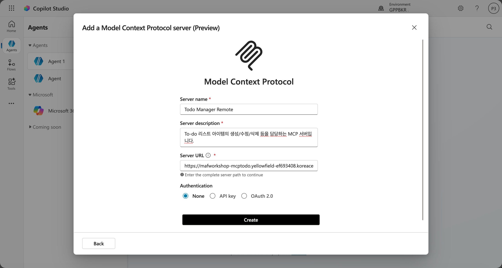

   - `Server name`: `Todo Manager Remote XXX` 👈 입력. XXX는 랜덤 숫자 또는 문자
   - `Server description`: `To-do 리스트 아이템의 생성/수정/삭제 등을 담당하는 MCP 서버입니다.` 👈 입력
   - `Server URL`: 앞서 복사해 둔 리모트 MCP 서버용 공개 주소 + `/mcp` 입력 (예: `mafworkshop-mcptodo.{랜덤문자열}-{랜덤숫자}.{지역}.azurecontainerapps.io/mcp`)
   - `Authentication`: `None` 👈 선택

1. 아래 화면이 나타나면 [Not connected] 버튼을 클릭한 후 [Create new connection] 버튼을 클릭합니다.

   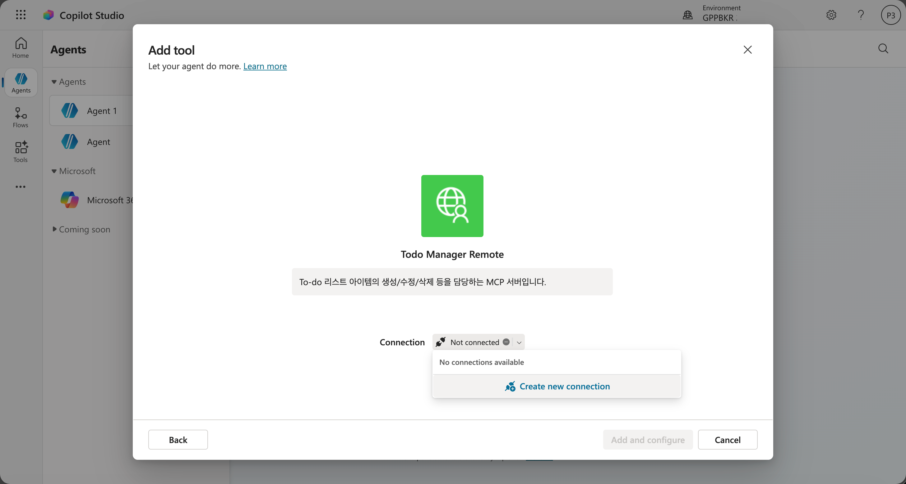

   이후 [Create] 버튼을 눌러 로컬 MCP 서버와 연결합니다.

   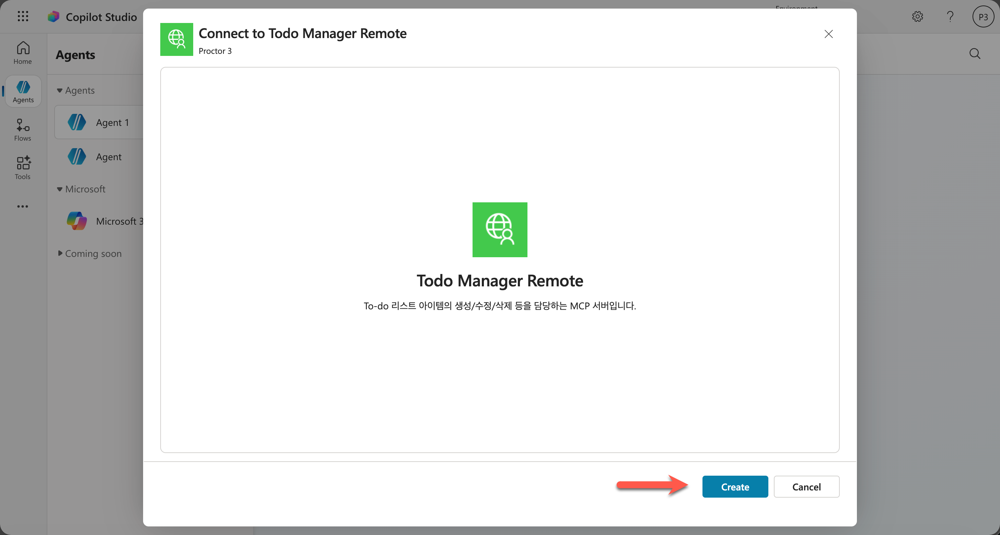

   이후 [Add and configure] 버튼을 클릭해서 로컬 MCP 서버를 에이전트에 추가합니다.

1. Copilot Studio에서 [Tools] 탭으로 이동한 후 [➕ New tool] 버튼을 클릭합니다.

   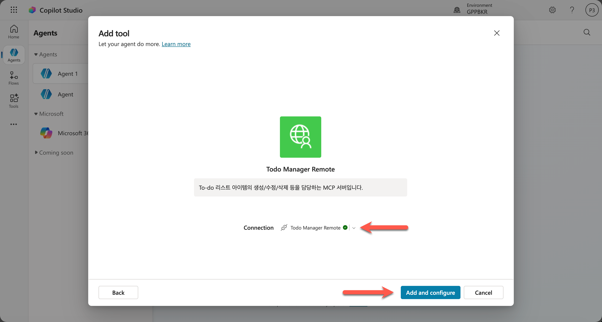

   MCP 서버에 정의해 둔 Tool이 보입니다.

   

1. [Settings] 버튼을 클릭합니다.

   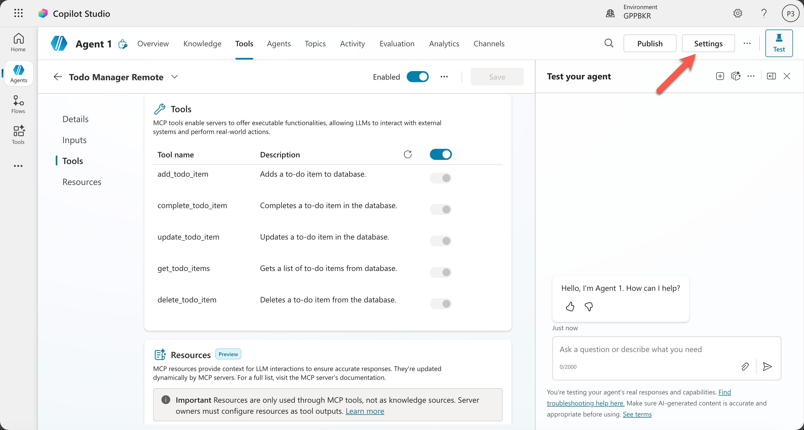

   현재 에이전트에 연결한 MCP 서버가 보입니다. [Connect] 링크를 클릭합니다.

   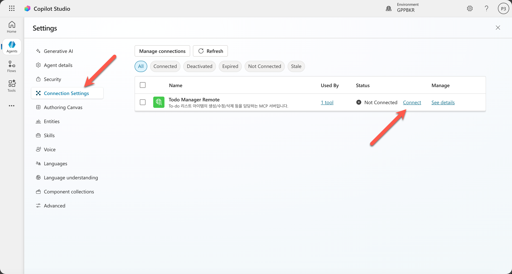

   [Submit] 버튼을 클릭합니다.

   

   커넥션 연결을 완료했습니다. 오른쪽 위의 [X] 버튼을 클릭해서 에이전트 Settings 화면을 빠져나갑니다.

   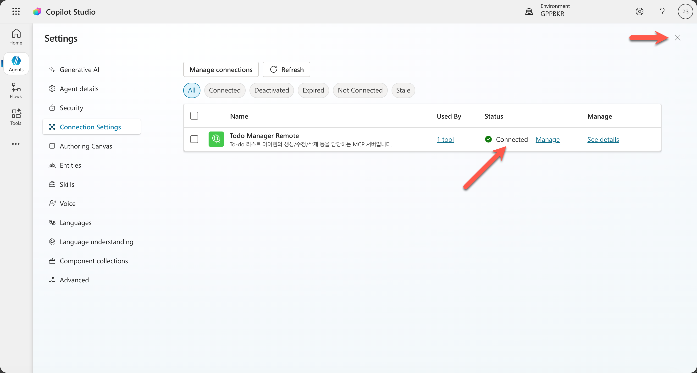

1. 아래와 같이 오른쪽 테스트 세션에서 다양하게 프롬프트를 실행시켜 보고 그 결과를 확인합니다.

   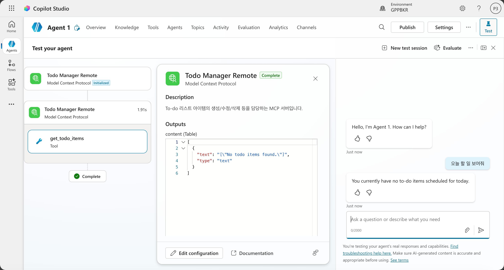

   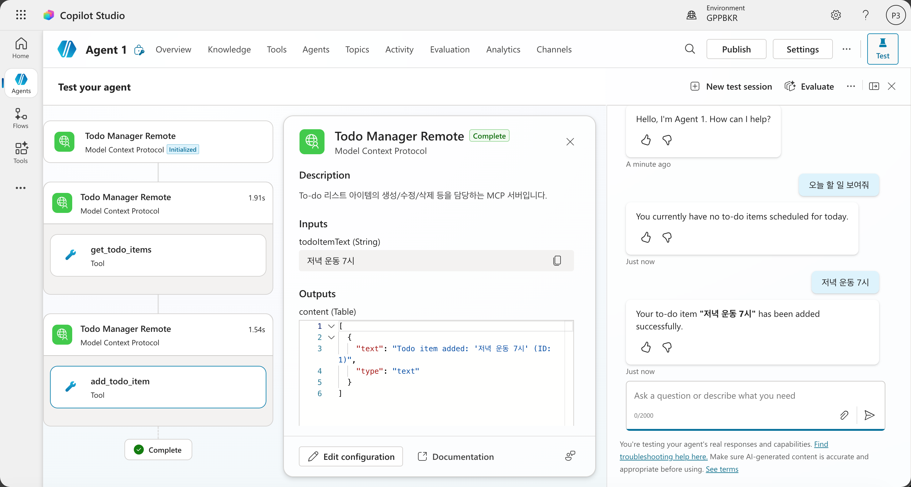

   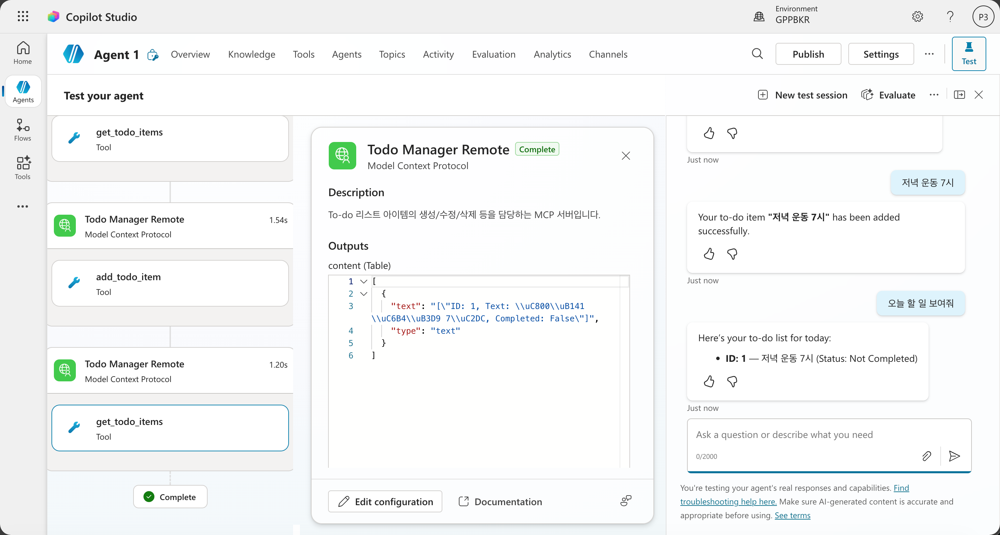

## 리모트 MCP 서버 리소스 삭제

1. 아래 명령어를 실행시켜 배포한 MCP 서버 애플리케이션을 삭제합니다.

    ```bash
    azd down --purge --force
    ```

---

축하합니다! Copilot Studio에서 에이전트를 개발하고 MCP 서버를 직접 연동해 봤습니다.

👈 [06: Microsoft Agent Framework에 MCP 서버 연동하기](./06-mcp-server-integration-with-maf.md) | [README](../README.md) 👉
